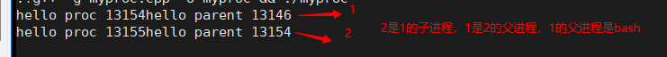
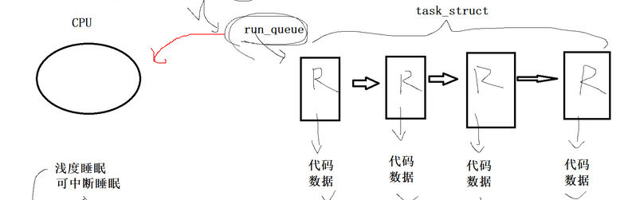
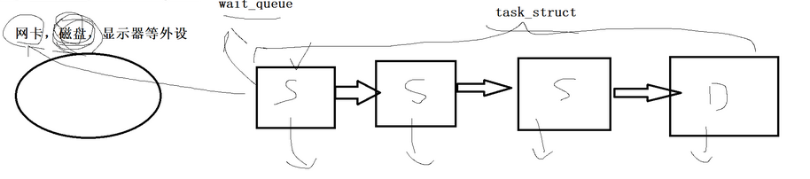
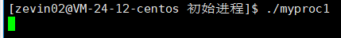
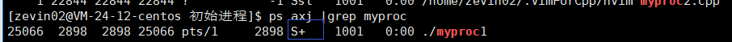
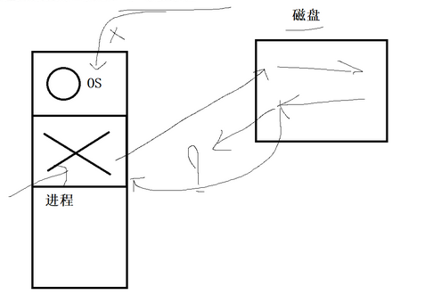

[TOC]

# 冯诺依曼体系结构

 冯诺依曼体系结构

1. 输入设备：键盘，磁盘（外设，读取文件（没读的时候就在磁盘）），网卡，显卡，话筒，摄像头(效率是s,ms级别)
2. 输出设备：显示器，打印机，磁盘（写文件，就是把数据写到磁盘上），网卡，显卡，音箱等
3. 存储器（内存）：离cpu越近的设备存储效率越高也越贵，有了内存，cpu就不用直接和外设打交道，存储器的快慢决定快慢（**内存是体系结构的核心设备**）
4. 运算器&&控制器（CPU）：运算器（算术运算与逻辑运算）
   控制器（读取指令，分析指令，执行指令）（效率ns级别）

如

> a和b通过qq发消息
> 

> 任何的外设，在数据层面，基本都是优先和内存打交道！，
> cpu，在数据层面上，也直接和内存打交道

# 操作系统
启动的（将软件数据与代码，加载到内存中）操作系统，才有意义

## 是什么
**OS** 是一款**软件**，专门针对**软硬件**资源进行管理工作的**软件**
（核心工作就是做管理的）

## 为什么
**对下**：管理好软硬件资源。对上：给用户提供**稳定高效安全**的运行环境
                  **方式**                                                  **目的**

## 怎么办
核心在**管理**，管理是对人的属性数据进行管理，描述属性结合的就是**结构体**，里面就有被管理者的全部数据，再加个联系指针**连接**起来（链表，哈希，树等），对**学生**的管理就变成了对链表的管理，对**学生的褒奖工作**就变成了对链表的**增删查改**

本质（**先描述再组织**）

>管理理念：先描述，再组织，
>可以转化成对目标的管理，
>转化成对数据的管理

# 进程（软件）
**加载到内存**的程序就叫做**进程**
系统中可能存在大量的进程，操作系统要**管理**进程
如何管理进程？
>先描述，再组织
>任何进程在形成的时候，操作系统要为该进程创建PCB，进程控制块（   先描述，struct PCB 里面就是进程的所有属性，结构体描述），

## PCB
<u>为了方便操作系统管理进程</u> 

---

OS 上面，PCB 进程控制块，就是一个结构体类型
在Linux系统中，PCB ->struct task_struct{  //进程的所有属性 }

>类比shell和bash的关系
>类比媒婆和王婆的关系

## 如
我们所有**启动的程序**的过程都是在系统上面**创建进程**

把程序运行起来，就是把程序加载到内存，就是把程序由磁盘加载到内存中变成一个进程

进程的属性
程序运行结束进程就结束了

## 进程vs程序

有了进程控制块，所有进程管理任务与进程对于的程序毫无关系！！！
与进程对应的内核创建的进程的	PCB 强相关

进程=程序+操作系统维护进程的相关数据结构（更多的数据结构）（进程控制块）

## PCB的内部构成
* pid：描述本进程的唯一标识符，原来区别其他进程

 

结束进程
kill -9 pid

* ppid:获得其父的pid（在命令行上运行的命令，基本上其父进程都是-bash）

 * 状态：任务状态，退出代码，退出信号等。
 0
    输出离他最近执行命令的退出码
   

* 优先级：相对于其他进程的优先级，CPU 只有1个，进程有非常多个，确认先后的问题，
* 程序计数器：程序中即将被执行的**下一条指令**的**地址**
* 内存指针：可以通过PCB 找到对应的代码和数据
* IO状态信息：进程可能要进行的IO，（从输入设备读入）（输出设备读出），进程在进行IO，
* 记账信息：进程被os调度器调度的信息（os为了较为均衡的调用每个进程（获得cpu的资源（进程被执行））），有处理器时间总和，使用的时间限制，记帐号
* **上下文数据**：（进程执行时处理器的寄存器中的数据）**寄存器**（<u>**寄存器只有一个**</u>，当前正在运行的进程的临时数据）
**时间片**（单次运行每个进程的<u>最大时间10ms</u>，没跑完，排到最后<u>等待继续运行</u>），在cpu情况下，用户感受到多个进程都在运行（靠cpu**快速切换**完成的），进程在运行期间是由切换的，进程可能存在大量的临时数据----》暂时在cpu的寄存器中保存， 
> 保护上下文
> 恢复上下文
> 虽然寄存器硬件只有一份，但是寄存器里面的数据是你这个进程的，走的时候，把寄存器里面的数据返回pcb里面，进入下一个进程，等待下一次使用，再进入时，<u>再把之前的临时数据放回cpu</u>

通过上下文的保护和恢复，我们可以感受到进程被切换的

## 查看进程的方案

ls /proc

exe就是当前执行的文件路径
cwd就是当前工作路径

# fork

fork就是用来创建子进程的

---

演示

~~~cpp
1 #include <iostream>
  2 using namespace  std;
  3 #include<unistd.h>
  4  
  5 int main()
  6 {                                                                 
  7     fork();//创建子进程
  8     cout<<"hello proc "<<getpid()<<"hello parent "<<getppid()<<endl;//会有两条显示
  9     sleep(1);                                                                                   
 10     return 0;                                                                                    
      
 11 }    
~~~

>上面的代码我们fork后，只写了一行的打印，但是运行结果是有两条的内容

##  如何理解fork创建子进程

>1. 有我们在命令行里面<u>./cmd or run command(执行指令)</u> ,与**fork**相比：在操作系统角度上，创建进程的方式都是没有差别的，只不过fork创建的进程间有**父子关系**
>
>2. fork本质是**创建进程**   ----> 系统里面**多了一个进程** --->在系统里面多了一份与进程相关的<u>内核数据结构</u> （task_struct） + 进程的<u>代码和数据</u>(我们只是fork了，创建了子进程，但是子进程对应的代码和数据)---------》
>
>* 默认情况下，会继承父进程的代码和数据
>* 内核数据结构task_struct 也会以父进程为模板，初始化子进程的task_struct
>
>> 例如父亲是做鞋的工厂老板，那么你就会继承父亲的基因（数据结构），同时你也会子承父业继续做鞋（继承代码和数据）
>>
>> ---
>
>**进程具有独立性**
>
>> 1. 代码
>>
>> * <u>fork之后子进程和父进程代码是共享的</u>  
>> * <u>代码是不可以被修改的</u>
>> * <u>父子代码只有一份</u>
>>
>> 2. 数据
>>
>> * **默认情况**下“数据也是共享的”，不过因为进程具有独立性，所以也要考虑修改的情况
>> * 可以通过“<u>写时拷贝</u>”来完成进程数据的独立性

## fork的返回值

我们创建的子进程，就是为了和父进程干一样的事情？？？

<u>一般是没有意义的，我们一般还是希望要让父进程和子进程做不一样的事</u>

<u>我们通常是用fork的返回值来完成</u>

> * 失败: <0
> * 成功: 
>   * 给父进程返回子进程的PID
>   * 给子进程返回0

~~~cpp
 1 #include <iostream>                                                       
  2 using namespace  std;             
  3 #include<unistd.h>  
  4 #include <sys/types.h>  
  5 int main()  
  6 {  
  7     pid_t id=fork();//获得其返回值 
  8     cout<<"hello proc "<<getpid()<< " hello parent "<<getppid()<<" ret: "<< id <<endl;  
  9     sleep(1);                                                                                            
 10     return 0;                                                                      
 11 }    
~~~

1. 如何理解有两个返回值？

   > 如果一行函数已经执行return，那么函数的核心功能执行完了
   >
   > ~~~cpp
   > pid_t fork()
   > {
   > //创建子进程的逻辑
   > 
   >  return XXX;//也是语句，父子共享return
   > }
   > ~~~
   >
   > 到return的时候，他创建子进程的逻辑也完了，所以子进程已经有了，父进程要return，子进程也要return
   
   * 返回的是数据吗？return的时候也会写入吗？
   
     > 返回的也是数据，会，发生了写时拷贝

2. 如何理解两个返回值的设置

   > 父：子=1：n，
   >
   > 子进程的父进程只有1个，而父进程可以有很多的子进程，所以要得到其子进程的pid来控制子进程，而子进程通过ppid就可以找到父进程
   >
   > 

## 对多进程的控制

~~~cpp
#include<iostream>
#include<unistd.h>
using namespace std;
int main()
{
    pid_t id=fork();
    if(id==0)//利用if else，进行分流，实现父子进程完成不同的事
    {
//child
        while(true)
        {
			cout<<"I am 子进程 pid="<<getpid()<<" ppid="<<getppid()<<endl;
            sleep(1);
        }
    }
    else if(id>0)
    {
        //father
		while(true)
        {
			cout<<"I am 父进程 pid="<<getpid()<<" ppid="<<getppid()<<endl;
            sleep(2);
        }
    }
    else
    {
        //失败
		//todo
    }
    sleep(1);
    return 0;
}
~~~

fork之后谁先跑呢？？

<u>不确定</u>

# 进程状态

进程的状态信息在哪里呢？？
<u>在 task_struct(PCB)</u>

进程状态的意义：

方便OS 快速判断进程，完成特定的功能，比如调度，本质是一种分类

## 具体的状态

* R：**运行态**，不一定正在CPU上面正在运行，但是如果处于**运行的队列**（<u>**等待CPU**</u>）中，那么这些状态都可以称为**R状态**，随时都可以被CPU进行调度

  

* S/D：**睡眠状态**，当我们想要完成某种任务的时候，任务条件不具备，需要进程进行某种等待时，就S，D，**等待资源就绪**

  如：今天想打游戏，但是电脑没开，那么我们就要开机等待电脑开机，那么此时我们就是S，D

  ---

  > 所谓的进程，在运行的时候可能会因为运行的需要，可以会在不同的队列里，
  >
  > 在不同的队列里面，所处的状态是不一样的

  

> 如果资源就绪了那么S状态就变成了R状态，放到运行队列里，
>
> 如果这个进程突然卡死了，那OS就会把他从运行队列放到等待队列里面去

> 我们把，从运行状态的task_struct（run_queue）,放到等待队列中，就叫做挂起等待（阻塞）
>
> 从等待队列，放到运行爹列，被CPU调度，就叫做唤醒进程

~~~cpp
#include<iostream>
#include<unist.h>
int main()
{
    sleep(10);
    cout<<"hello "<<endl;
return 0;
}
~~~

> 等待我们设定的10s就绪，那么他就处于S状态，
>
> 可以直接立即终止（可中断睡眠）

* **深度睡眠** ；不可中断睡眠，

  > 假设进程发出了一个命令，要将1t数据（数据量非常大）都放到磁盘里面，让磁盘去读写，之后磁盘就开始工作了，这个时候进程就开始等待
  >
  > 等待磁盘把任务完成，这个时候，OS来了发现进程在休息，就把他给杀掉了，
  >
  > 磁盘读写完了，要把失败与否的结论告诉进程，但是发现进程不见了，
  >
  > 进程：是OS把我杀掉的
  >
  > 磁盘：是进程不见的
  >
  > 没有办法解决问题
  >
  > ---
  >
  > 本质上是因为操作系统把正在等待的进程给杀掉的
  >
  > 

  

所以为了解决这个问题，就有了深度睡眠的D状态，

<u>**进程进入了D状态，不可被杀掉**</u>

* T :**暂停状态**，完全暂停不会因为某种条件达成变成R,做某些任务的时候，进程需要暂停

* t（trace stop）：经常调试程序的时候，在调试的时候，进程所处的状态，打个断电，就停下来了，临时查看很多资源数据

* x（dead）：**死亡状态**，回收进程资源=<u>进程相关的数据结构</u>+<u>你的代码和数据</u>（和创建的操作是一样的），死亡状态无法查到

* z（zombie）：**僵尸状态**，先进入<u>僵尸状态</u>再进入<u>死亡状态</u>

  ---

  

  * 为什么要有僵尸状态

    > 为了辨别退出**死亡**原因，进程退出时要暂时保存退出的信息
    >
    > 在task_struct存了进程退出的所有信息

## 状态代码验证

### R

：没有IO ，所以就不用等待

~~~cpp
  1 #include<iostream>
  2 using namespace std;
  3 int main()
  4 {
  5     while(true);
  6     return 0;                                                                                            
  7 }

~~~

### S

~~~cpp
  1 #include<iostream>
  2 using namespace std;
  3 int main()
  4 {
  5     while(true)
  6     {
  7     ?   cout<<"hello"<<endl;
  8     }                                                                                              
  9     return 0;         
 10 }                     
~         
~~~

有可能还能检测到r状态

> 打印，是往显示器打印，外设慢，IO，实际上等待外设就绪是很慢的，所以大部分状态都是S状态，CPU太快了

暂停进程

继续进程

后面没有+号，在后台运行

但是按ctrl c无法结束进程

结束进程

### +

：带了+，说明是在前台运行，在命令行输入任何内容都是没有用的，但是ctrl c来干掉进程

后台进程./myproc &，就变成后台进程，可以在命令行中输入命令，无法用ctrl c来结束进程，只能用kill -9 pid来结束进程

### z

如果没有人<u>检测回收进程</u>（父进程），该进程退出或进入z

~~~cpp
1 #include <iostream>                                                                                
  2 #include<unistd.h>
  3 using namespace std;
  4 int main()                                       
  5 {                 
  6     pid_t id=fork();
  7     if(id==0)
  8     {                 
  9        //child       
 10        while(true)
 11       {                
 12          cout<<"I am child,running"<<endl;
 13           sleep(2);
 14        }                                   
 15     }                                       
 16     else           
 17     {  
 18        //father
 19        cout<<"I am father ,doing nothing"<<endl;
 20        sleep(50); 
 21     }  
       return 0;
 22 }
      
~~~

把**子进程给终止掉**，但是父进程没有回收，就变成了僵尸进程

（子进程先死了，父进程还在运行）

#### 孤儿进程

被1号进程领养，1号进程也叫做操作系统OS

父进程终止了，子进程还在运行

~~~cpp
  1 #include <iostream>                                                                                
  2 #include<unistd.h>
  3 using namespace std;
  4 int main()                                       
  5 {                 
  6     pid_t id=fork();
  7     if(id==0)
  8     {                 
  9        //child       
 10        while(true)
 11       {                
 12          cout<<"I am child,running"<<endl;
 13           sleep(2);
 14        }                                   
 15     }                                       
 16     else           
 17     {  
 18        //father
 19        cout<<"I am father ,doing nothing"<<endl;
 20        sleep(10);
     exit(-1);
 21     }  
       return 0;
 22 }
~~~

