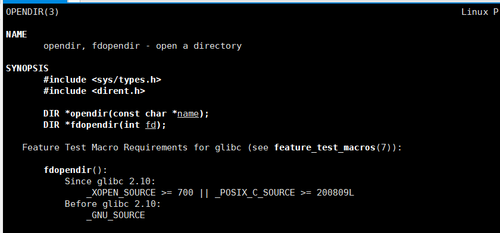
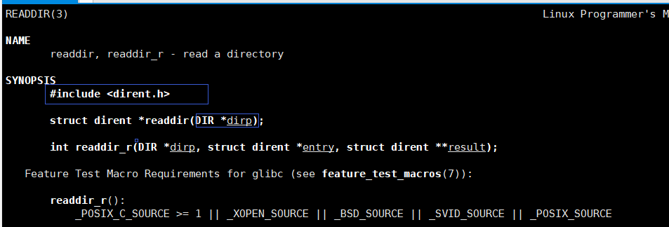
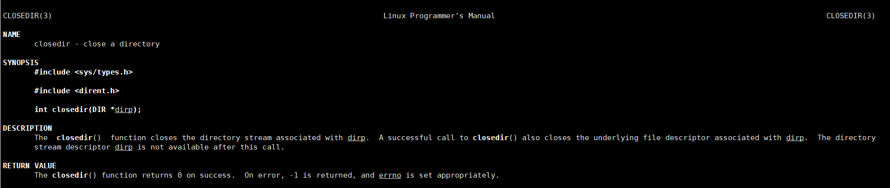

# 模拟实现ls

ls命令能够做什么呢

* 罗列出目录的内容

  ~~~text
  ls ~
  ~~~

* 显示文件的信息

~~~text
ls -l ~
~~~

## 罗列目录内容

>1. 首先要先打开一个目录
>2. 读取目录中的文件
>3. 将目录中的文件打印出来
>4. 关闭目录

### 打开一个目录（opendir）

#### 头文件

~~~cpp
 #include <sys/types.h>
       #include <dirent.h>

~~~

####  函数用法

~~~cpp
 DIR *opendir(const char *name);
~~~

打开name目录，成功返回一个DIR *的目录流，失败就返回空

演示

~~~cpp
#include<iostream>  
  2 #include<sys/types.h>  
  3 #include<dirent.h>  
  4 using namespace std;  
  5                                                                                                                                                                                                      
  6 void test_opendir()                                                           
  7 {                                                                             
  8     DIR* a=opendir("~/pass");                                                 
  9     cout<<a<<endl;                                                            
 10 }                                                                             
 11                                                                                                                                               
 12 int main()                                                                                                                                    
 13 {                                                                                                                                             
 14     test_opendir();                                                                                                                           
 15     return 0;                                                                                                                                 
 16 }  
~~~

#### 返回值

DIR *

原型

~~~cpp
struct __dirstream   
   {   
    void *__fd;    
    char *__data;    
    int __entry_data;    
    char *__ptr;    
    int __entry_ptr;    
    size_t __allocation;    
    size_t __size;    
    __libc_lock_define (, __lock)    
   };   
typedef struct __dirstream DIR;
~~~

### 读取目录中的文件（readdir）

~~~cpp
 struct dirent {
               ino_t          d_ino;       /* inode number */
               off_t          d_off;       /* not an offset; see NOTES */
               unsigned short d_reclen;    /* length of this record */
               unsigned char  d_type;      /* type of file; not supported
                                              by all file system types */
               char           d_name[256]; /* filename */ 文件名
           };

~~~

返回值：成功则返回下个目录进入点. 有错误发生或读取到目录文件尾则返回NULL.

### 关闭目录

模拟实现

~~~c
 #include<sys/types.h>
    2 #include<dirent.h>
    3 #include<stdio.h>
    4 void ls(char dirname [])//目录名称
    5 {
    6 DIR* dir_ptr;//目录指针
    7 struct dirent *direntp;//目录中的文件内容参数
    8 if((dir_ptr=opendir(dirname))==NULL)//假如说失败了
    9 {
   10     fprintf(stderr,"can not open %s\n ",dirname);
   11 }
   12 else
   13 {
   14     while((direntp=readdir(dir_ptr)))
   15     {
   16     ¦   printf("%s  ",direntp->d_name);
   17     }
   18     printf("\n");
   19     closedir(dir_ptr);
   20 }
   21 }
   22 int main(int argc,char*argv[])//size是字符串的长度 dirent是目录的路径名
   23 {
   24     if(argc==1)//none string 
   25     {
W> 26     ¦   ls(".");//default current direct
   27     }
   28     else
   29     {
   30     while(--argc)
   31     {
   32 //        printf("%s:\n",* ++dirent);
   33 ++argv;                                                                                                                                                          
   34     ¦   ls(*argv);
   35     }
   36     }
   37     return 0;
   38 }

~~~

